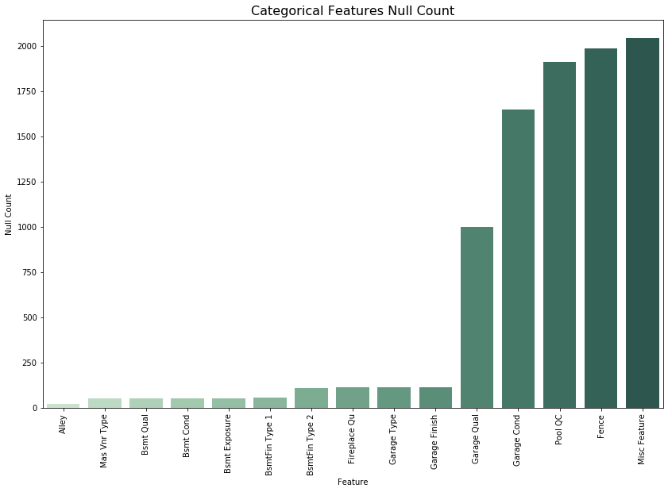
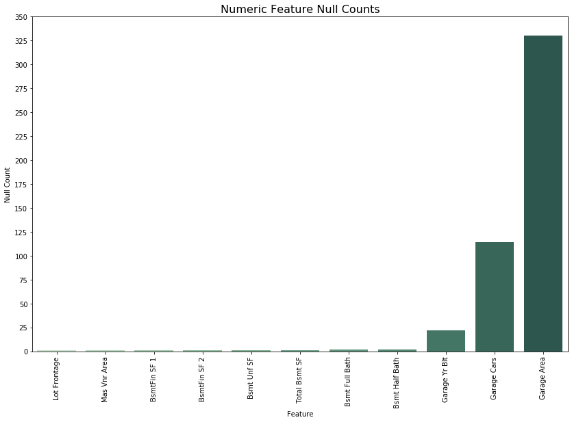
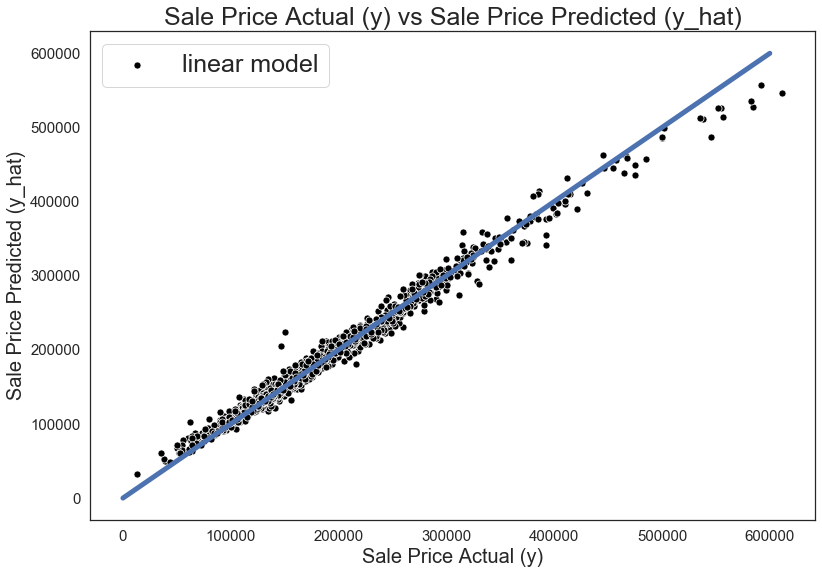

# Kaggle Competition: Ames Housing Price Prediction

### Contents:
- [Problem Statement](#Problem-Statement)
- [Executive Summary](#Executive-Summary)
- [Conclusions](#Conclusions)

### Problem Statement 

**Predict home prices in Ames Iowa.**
A comparison study that aims to show which model works best for this geography, demographics and home type.
Sucess is evaluated by comparing RSME for train and test data as well as MSE and $R^2$ for those respective data types.
Audience is anyone looking to buy a home in in Ames Iowa between before roughly this  present 2019 date. Anyone trying to model the price of their homes based on similar features or even home sellers trying to price their home. 

### Executive Summary

Project 2 begins with the main file which in which I model the provided data in the dataset folder. This was acomplished by taking 2051 train data samples or rows and 879 test data rows or samples to train my model and make a predicting. EDA and cleanig, general housekeeping, and feature engineering was the first labor intensive part. The second part, the modeling was much easier but took several iterations before honing in on the right hyperparameters. Model ended up being overfit. A good problem to have generally speaking. Backed down some of the overfit issue by adding a lasso model into the equation. $R^2$ of 0.98 for train and $R^2$ 0.92 for test with an RMSE of 10000 and 22000 respectively.

The null counts per feature of both numeric and categorical values are shown above. In large the trend seems to be a very few features, three max, with a lot of missing values while the rest of the null containing features were missing only a handfull of the 2051 rows or observations.
Below is the final output of the notebook in termes of graphs. This plot is a scatterplot with a 1 to 1 line of y vs y_hat. This shows the linear relationship between the true SalePrice and the predicted price.

### Conclusions

With 26 features that had missing values from one to nearly all missing the challange stemmed from learning a way to impute or in other words calculate what said missing values were. For some features it was simple, NA likely meant no feature present like pool size. So for those features it was clear what to do, while also clear to add something for floating data that was likely not added due to carelessness or other reasons. This data was managed by taking the mean of the data and adding the same value for all mising data. This was crude and not ideal. In a perfect world where time is not on such a crunch, I would model the non missing data and predict the missing data from that non missing data. Effectively making the constant guesses variant. Now for the hardest part, what do we do with categorical data that is missing but taking the average would not make sence because the data is for the lack of a better term quantized. If the quality is integer based and goes up from zero to ten by 1 imputing a value of 4.25 would not have any real world value. For this category of data I made the NA's dummies or in other words converted the NA's into a feaature of 0 or 1 if NA was there.
Created functions to test for the best hyperparameter and estimator pair. The test RMSE is 22000 while the train RMSE 10000.
With an $R^2$ value of 0.98 for train data and 0.92 for test. Although this is a relatively good prediction, the model is still overfit. There are a few outliers but only one that is worth writing about. Further feature engineering where we model the NA values rather than imputing by filling NA values with means could fix the issue. This is because the mean might grossly overestimate the values filled in which can have this impact. The model would also improve in this case. It is wise not to skip on this alternative method of imputing but there is a crunch for time in this case so it will be left for future work.
Limitations: The limitations of this model are two as such; geography and time. There is a time decay to this model. We are in 2019 and the data was collected between 2006 to 2010. This means features may be outdated or otherwise not available. This model is also not optomized for different geographies or even demographics.
